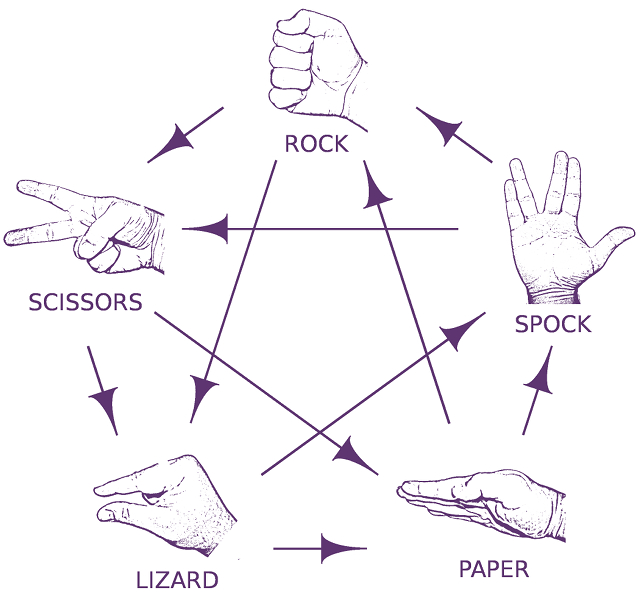

# Rock, Spock Game
## Online Browser Game

Rock, Spock Game is the game where player compete against computer. The game is written in HTML, CSS and JS. Game is working on all browsers and all devices.

## Features

- Play against computer
- Rules explained on the screen 
- Display current points
- Reset the result
- 
##Rules



## Tech

Project logic is written in JavaScript with interface in HTML and CSS.

## Screenshots


## Code

### Game Variables

storing game settings

```js
const figures = { 

  0: "Spock", 
  
  1: "Rock", 
  
  2: "Scissors", 
  
  3: "Paper", 
  
  4: "Lizard" 
  
  } 
  
  
  const wins = { 
  
  0: [1,2], 
  
  1: [2,4], 
  
  2: [3,4], 
  
  3: [0,1], 
  
  4: [0,3] 
  
  } 
  
  
  const icons = { 
  
  0: "fa-solid fa-hand-spock", 
  
  1: "fa-regular fa-hand-back-fist", 
  
  2: "fa-solid fa-hand-scissors", 
  
  3: "fa-solid fa-toilet-paper", 
  
  4: "fa-solid fa-hand-lizard" 
  
  } 
  
    const rule = { 
  
      Lizard: ["Spock", "Paper"], 
      
      
      Paper: ["Rock", "Spock"], 
      
      
      Rock: ["Lizard", "Scissor"], 
      
      
      Scissor: ["Paper", "Lizard"], 
      
      
      Spock: ["Scissor", "Rock"], 
  
  }; 
```

### HTML controls variables

Elements displaying game state.

```js
  const playerIcon = document.getElementById("player-icon"); 
  
  const computerIcon = document.getElementById("computer-icon"); 
  
  const playerIconMobile = document.getElementById("player-icon-mobile"); 
  
  const computerIconMobile = document.getElementById("computer-icon-mobile"); 
  
  
  const playerScoreSpan = document.getElementById("player-score"); 
  
  const computerScoreSpan = document.getElementById("computer-score"); 
  
  
  const resetBtn = document.getElementById("reset-btn"); 
```

### Resetting game

```js
  document.addEventListener('DOMContentLoaded',() => { 
  
  
  resetBtn.addEventListener("click",() => { 
  
  computerIcon.className = ""; 
  
  playerIcon.className = ""; 
  
  playerPoints = 0; 
  
  computerPoints = 0; 
  
  updatePoints(); 
  
  }) 
```

### Game logic

Click action event listener. Calculating points and displaying game state.

```js
let options = document.getElementsByClassName("option"); 
  
  
  Array.from(options).forEach(el => { 
  
  el.addEventListener('click', e => { 
  
  console.log(el); 
  
  let opt = parseInt(el.dataset.index); 
  
  
  if(opt > -1){ 
  
  playerIcon.className = icons[opt]; 
  
  playerIconMobile.className = icons[opt]; 
  
  
  let copt = getComputerIndex(); 
  
  computerIcon.className = icons[copt]; 
  
  computerIconMobile.className = icons[copt]; 
  
  
  if(wins[opt].indexOf(copt) > -1){ 
  
  playerPoints++; 
  
  } 
  
  else if(wins[copt].indexOf(opt) > -1){ 
  
  computerPoints++; 
  
  } 
  
  updatePoints(); 
  
  } 
  }); 
  }); 
  }); 
```


